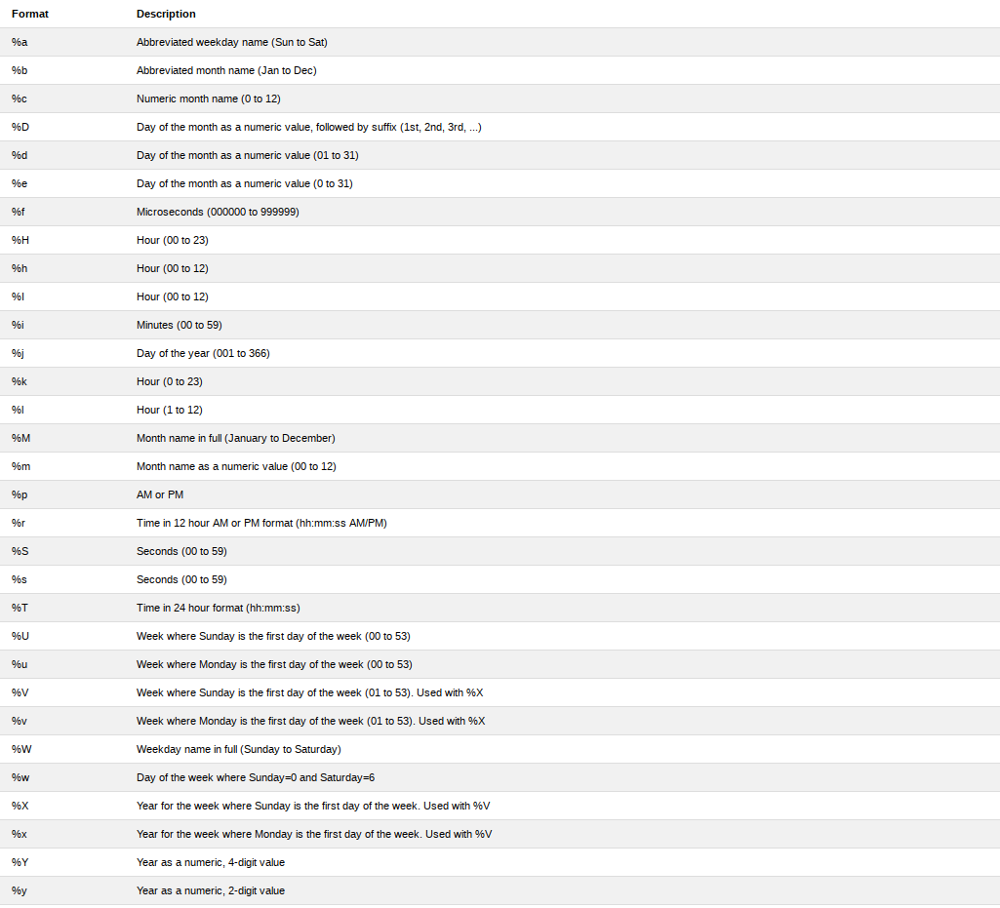

# ~ Learning SQL ~

### Description
I love learning new things but I can't help forgetting some. This is why I do this short summaries in a 'cheatsheet' like manner, to be able to keep all important details in one place. 

**NOTE**

While learning SQL, I have found "The Ultimate MySQL Bootcamp: Go from SQL Beginner to Expert" Course on Udemy to be very useful. [Check it out](https://www.udemy.com/the-ultimate-mysql-bootcamp-go-from-sql-beginner-to-expert)!

| #   | Name                              | About (or What's New)	        | Link                                 |
| --- | --------------------------------- | ----------------------------------- | ------------------------------------ |
| 1   | My first SQL problem              | Basic CRUD Commands     		| [Link-name2](.#General-Commands)        |

[CONTRIBUTE](.#4---contribute)


# Contents 

| #   | Name                              | About (or What's New)	        | Link                                 |
| --- | --------------------------------- | ----------------------------------- | ------------------------------------ |
| 1   | My first SQL problem              | Basic CRUD Commands     		| [Github](./src/shirts_db.sql)        |
| 2   | String functions                  | Strings                 		| [Github](./src/strings.sql)          |
| 3   | Refined Strings                   | ORDER, AS, LIMIT        		| [Github](./src/refined_strings.sql)  |
| 4   | Aggregate Functions               | COUNT, SUM, MIN/MAX, GROUP BY       | [Github](./src/agg.sql)              |
| 5   | Logical Operators                 | IN, CASE, <=>, AND, OR, NOT         | [Github](./src/log_opp.sql)          |
| 6   | Basic Joins                       | INNER JOIN, LEFT JOIN, RIGHT JOIN   | [Github](./src/basic_joins.sql)      |
| 7   | Many-to-Many                      | Multiple JOIN,INNER JOIN, L/R JOIN  | [Github](./src/many-to-many.sql)     |
| 8   | Instagram Clone Exercice          | Big(-ish) Data, HAVING 	        | [Github](./src/insta_exercice.sql)   |

## Tips and Tricks
Short tips and tricks that got the SQL work flowing (for me).

## General Observations
- the string "<column_name1>, <column_name2>,...,<column_nameN>" (or similar) appears in some cases and it means that any existent column can or not be chosen (depends on the case). Minimum chosen column is one.

## Theoretical Bulletpoints

- a Database is a collection of data
- Database != Database Management System (DBMS)
	- Some DBMS are : PostgreSQL, MySQL, Oracle Database
- in use Database = structured set of computerized data with an accessible interface
- DBMS are valuable because of the unique features they offer
- All data is stored in Tables (columns and rows)

## Data Types


| Numeric Types   | String Types 		 | Data Types 	|
| --------------- | ---------------------------- | ---------- 	| 
| INT		  | CHAR 	 		 | DATA 	|
| SMALLINT 	  | VARCHAR 	 		 | DATETIME 	|
| TINYINT 	  | BINARY 	 		 | TIMESTAMP 	|
| MEDIUMINT 	  | VARBINARY 	 		 | TIME 	|
| BIGINT 	  | BLOB 	 		 | YEAR 	|
| DECIMAL 	  | TINYBLOB 	 		 | - 		|
| NUMERIC 	  | MEDIUMBLOB 	 		 | - 		|
| FLOAT  	  | LONGBLOB 	 		 | - 		|
| DOUBLE 	  | TINY-, MEDIUM-, LONGTEXT	 | - 		|
| BIT 		  | ENUM 		    	 | - 		|


### NOTES about Data Types
_**DECIMAL**_
- Most precise, fixed-point type -> calculations are exact.

Syntax:
```
<column_name> DECIMAL(N,M);
```
- N = total number of digits the decimal number could contain
- M = digits after decimal point

_**Float**_
- Loses precision at ~7 digits. Floating-point type.
- take up 4 Bytes of memory

_**Double**_
- Loses precision at ~14 digits. Floating-point type.
-take up 8 Bytes of memory

_**DATE**_
- Format: 'YYYY-MM-DD'

_**TIME**_
- Format: 'HH:MM:SS'

_**DATETIME**_
- Format: 'YYYY-MM-DD HH:MM:SS'

**The CAST Function**
- changes the format (e.g. string to datetime)
Syntax:
```
CAST ("<date_string>", AS <date_data_type>);
```

## Useful Commands

### For Cloud9

**Start/stop MySQL**
```
mysql-ctl start;
mysql-ctl stop;
```

**Start/stop MySQL Interactive Shell**

```
mysql-ctl cli;
exit;
```


### General Commands

**Show all databases** 

```
SHOW DATABASES; 
```

**Create a database **

```
CREATE DATABASE <database_name>;
```

**Delete a database (drop a DB)**
```
DROP DATABASE <database_name>;
```

**Use a Database (for CRUD commands = Create, Read, Update, Delete )**
```
USE <database_name>;
```

**Check the name of the current database (in use)**
```
SELECT database();
```

**SQL Files**

- SQL files have the .sql extension
- SQL files can be run from within a SQL environment using the _source_ command

_**Example**_
```
source <file_name>.sql; -- This is valid only if the file exists in the working directory
source <path_to_file>/<file_name>.sql; 
```
## CRUD 
**CREATE**
``` 
CREATE DATABASE <database_name>; -- Creates a database
CREATE TABLE <table_name>; -- Creates a table in the current database 
```

**READ (SELECT)**

Retrieve columns _without condition_
```
SELECT * FROM <table_name>; -- retrieves all columns from the chosen table
SELECT <column_name1>, <column_name2>,...,<column_nameN> FROM <table_name>; -- retrieves chosen columns from the chosen table
```
Retrieve columns _with contidion_
```
SELECT * FROM <table_name> WHERE <column_name> = value; -- <column_name> = value means that the value present in a certain column is equal to the given value
```
Retrieve specified column under _a different name (Alias)_
```
SELECT <column_name> as <ALIAS> from <table_name>;
```

Retrieve multiple columns and _concatenate_ them
```
SELECT CONCAT (<column_name1>, <column_name2>,...,<column_nameN>) FROM table_name; -- without separator
SELECT CONCAT (<column_name1>, 'text1', <column_name2>,'text2',...<column_nameN>) FROM table_name; -- with text between the contents of the columns
SELECT WS_CONCAT ('<chosen_separator>' , <column_name1>, <column_name2>,...,<column_nameN>) FROM table_name; 
```

Using _**SUBSTRING**_
```
SELECT SUBSTRING(<column_name>, start_indice_value, end_indice_value) FROM <table_name>; -- OBSERVATION: Indices start at 1
SELECT SUBSTRING(<column_name>, start_indice_value) FROM <table_name>; -- In this case, end_indice_value=string length

SELECT SUBSTRING(<column_name>, -start_indice_value) FROM <table_name>; 
-- -start_indice_value is < 0 -> start indice will have the value string_length - start_indice_value 
-- -> The substring will contain the characters (string_length - start_indice_value , string_length) 
```
Using _**REPLACE**_

Replaces chosen part of a string
```
SELECT REPLACE (string, pattern_to_replace, replace_string) FROM <table_name>; -- replaces all found patterns in the string
```

**UPDATE**
```
UPDATE <table_name> SET <column_name>=value_to_set WHERE <column_name> = value_to_update;
```

**DELETE**
```
DELETE FROM <table_name> WHERE <column_name> = value;
```

**Insert DATA into a table**
``` 
INSERT INTO <table_name> (<chosen_column_name1>, <chosen_column_name2>...<chosen_column_nameN>) VALUES (<value_for_column1>, <value_for_column2>...<value_for_columnN>);
```

Multiple entries can be inserted with only one comand at once, separated by comma ' , '

_**Example**_

```
CREATE DATABASE test_db; -- Creates a database called test_db
USE test_db; -- Sets test_db as current database
CREATE TABLE example_table (value INT, name VARCHAR (50) DEFAULT "NO_NAME"); -- Creates a table in test_db
INSERT INTO example_table(value, name) VALUES (25, 'Buck'),(13, 'Deer'); -- Inserts two entries in the example_table
```

**Set a MANDATORY column (not NULL)**
``` 
CREATE TABLE <test_table_name1> (<column_name1> <data_type> NOT NULL)
```

**Set a DEFAULT value for a table column**
``` 
CREATE TABLE <test_table_name2> (<column_name1> <data_type>,<column_name2> <data_type2> DEFAULT <default_value_of_same_data_type_as_column_name2> );
```

**Set a PRIMARY KEY**
```
CREATE TABLE <test_table_name3>( <column_name1> <data_type1>, <column_name2> <data_type2> , PRIMARY KEY(column_name_of_choice));
```
_**ALSO VALID**_

```
CREATE TABLE <test_table_name4>( <column_name1> <data_type1> PRIMARY KEY, <column_name2> <data_type2>  );
```
**Create a table with an ID COLUMN (with AUTO_INCREMENT)**
```
CREATE TABLE <test_table_name5> (<column_name1> INT AUTO_INCREMENT PRIMARY KEY, <column_name2> <data_type2> );
```

## USEFUL FUNCTIONS

Some of the most common (and useful) functions in SQL.

**CHAR_LENGTH()**

_Example_

```
SELECT CHAR_LENGTH(<column_name>) FROM <table_name>;
```

**UPPER()/LOWER()**

_Example_
```
SELECT UPPER(<column_name>) FROM <table_name>;
```
**DISTINCT**

Returns only the unique (distinct) values.
```
SELECT DISTINCT <column_name> FROM <table_name>;
```

**ORDER BY**

Returns values in ascending(DEFAULT) or descending (DESC) order.
```
SELECT <column_name> FROM <table_name> ORDER BY <CHOSEN_column_name>;--ASCENDING ORDER
SELECT <column_name> FROM <table_name> ORDER BY <CHOSEN_column_name> DESC;--DESCENDING ORDER
-- OBSERVATIONS! CHOSEN_column_name is the column by which the results are sorted.

SELECT <column_name1>, <column_name2>,...,<column_nameN> ORDER BY M; -- M <= N, the results are ordered by the M-th column
```

**LIMIT**

Limits the number retrieved values.
```
SELECT <column_name> FROM <table> LIMIT N;--N = number of rows to show;  N <= total entries

SELECT <column_name> FROM <table> LIMIT <start_ind>, N;
--start_ind is the indice of the first retrieved value; start_ind >=0
--N = number of rows to show;  N <= total entries
```

**LIKE**

Returns the values that are similar to a given pattern.

```
SELECT <column_name> FROM <column_table> WHERE <column_name> LIKE '<pattern>';
```
- **WILDCARDS** can be used ('%') in combination with strings; 
- they have the meaning of "anything goes" before the specified string or after

_Example:_
```
SELECT author_name FROM database WHERE author_name LIKE "%david%";-- will return all author names that contain the name David
```

- **"_" (underscore)** can also be used that replaces a character/ "\__" (2 underscores) replace 2 characters and so on

_Example:_
```
SELECT author_name FROM database WHERE author_name LIKE "%Andre_";
-- possible names can include names such as "Andrew", "Andrea", "Andres"
```
**NOTE:** 
- If a searched value contains special characters (such as "%" or "_"), an ESCAPE CHARACTER can be used "\" (backslash)

_Example:_
```
SELECT title FROM database WHERE title LIKE "%100\%%";
-- returns titles containing "100%"
```

**IN**
- returns an entry if its value matches one of the given values

Syntax:
```
SELECT * FROM <table_name> WHERE <column_name> IN (<value1>, <value2>,..., <valueN>);
```

**CASE**
Syntax:
```
CASE WHEN <condition> THEN <value1>
     ELSE <value2>
END
```

**ISNULL()**
- replaces the NULL with a given value

Syntax:
```
ISNULL(<field_name>,<replace_value>)
```


#### DATE AND TIME

**CURDATE(), CURTIME(), NOW()**
- returns current **DATE**, **TIME** and **DATETIME** respectively 

Syntax:
```
-- To print ->
SELECT CURDATE();
SELECT CURTIME();
SELECT NOW();
```

**DATE_FORMAT()**
- really useful function that enables date printing
- check [documentation](https://www.w3schools.com/sql/func_mysql_date_format.asp)




Syntax:
```
SELECT DATE_FORMAT(<DATETIME>, '%P1(<string>)%P2(<string2>)...%PN') FROM <table_name>; 
```

### DATE AND TIME MATH

**DATEDIFF**
- return the difference in days between two dates

Syntax:
```
SELECT DATEDIFF(<date1>,<date2>) FROM <table_name>;
```

**DATE_ADD**
- adds specified interval to given date

Syntax:
```
SELECT DATE_ADD(<date1>, INTERVAL <number> <interval_name>) FROM <table_name>;
-- <interval_name> is a time interval (e.g. MONTH, HOUR, SECOND)
-- <number> is an INT, indicates the number of intervals added to <date1>
```

**Shortcut**
- add or substract an interval from a given date

Syntax:
```
SELECT <date1> + INTERVAL <number> <interval_name> FROM <table_name>; -- addition
SELECT <date1> - INTERVAL <number> <interval_name> FROM <table_name>; -- substraction
```

**Add (or substract) multiple intervals**

Syntax:
```
SELECT <date1> + INTERVAL <number1> <interval_name1> + INTERVAL <number2> <interval_name2> FROM <table_name>;
```

### TIMESTAMPS
- Same format as DATETIME but:
- **DATETIME**:
	- takes 8 bytes of memory 
	- goes from year 1000 to year 9999
	
- **TIMESTAMP**:
	- takes 4 bytes of memory
	- TIMESTAMP goes from year 1970 to year 2038
**TIMESTAMP**
- introduced at the creation of the table
Synatx:
```
CREATE TABLE <table_name> <column_name1> <data_type1>,<column_name2> TIMESTAMP DEFAULT NOW(); 
-- <column_name1> is arbitrary
-- <column_name2> can be something like "created_at"
-- TIMESTAMP DEFAULT NOW() enters the (current) date and time of the newly created entry
```
- TIMESTAMP can be used to store the date and time one entry was modified

Syntax:
```
CREATE TABLE <table_name> <column_name1> <data_type1>,<column_name2> TIMESTAMP DEFAULT NOW() ON UPDATE CURRENT_TIMESTAMP; 
-- OR
CREATE TABLE <table_name> <column_name1> <data_type1>,<column_name2> TIMESTAMP DEFAULT NOW() ON UPDATE NOW();

```

### AGGREGATE FUNCTIONS
Aggregate Functions are functions that perform a calculation on a set of values, and returns a single value.

**COUNT**
_Example:_

``` SELECT COUNT (*) FROM <table_name>;-- counts the number of entries in a table
```
**GROUP BY**
GROUP BY summarizes or aggregates identical data into singel rows. Other functions can be afterwards used, to obtained helpful results (functions such as COUNT).
_Example:_
```
SELECT <column_name1> FROM <table_name> GROUP BY <chosen_column_name>; -- only shows first element of the group

SELECT <column_name1>, <column_name2>, COUNT(*) FROM <table_name> GROUP BY <chosen_column_name1>, <chosen_column_name2>;
-- Each group contains elements that have the same first chosen column value and second chosen column value.
-- The third column will contain the number of elements from each group.
```

### !!!OBSERVATION!!!
- "**WHERE**" can only be used BEFORE "**GROUP BY**" -> USE "**HAVING**" for grouped queries  

**MIN/MAX**
```
SELECT MIN(<chosen_column_name>) FROM <table_name>;
```

**SUM**
```
SELECT SUM(<chosen_column_name>) FROM <table_name>;
```

**AVG**
Returns the average of a chosen column
```
SELECT AVG(<chosen_column_name>) FROM <table_name>;
```

## Logical Operators
- not equal -> "!=" 
- are not alike -> "NOT LIKE"
- greater than -> ">"
- smaller than -> "<"
- greater or equal -> ">="
- and -> "&&" or "AND"
- or -> "||" or "OR"
- between -> "BETWEEN ... AND ..." !!! MARGINS INCLUDED !!!


## Data Relationships
- 1 to 1 
- 1 to many
- many to many

**Foreign Key**

Sytax:
```
FOREIGN KEY (<column_name>) REFERENCES <foreign_table_name>(<corresponding_column_name>);
```
### JOINS

- Cross Join
- Inner Join
	- Implicit Inner Join
	- Explicit Inner Join
- Left Join
- Right Join

 **Cross Join**
- prints all combinations (useless)

Syntax:
```
SELECT <column_name1>,<column_name2>,...,<column_nameN> FROM <table_name1>,<table_name2>;
```

**Implicit Inner Join**
- prints entries that match specified criteria
- it is written implicitely (without mentioning that it is a JOIN)

Syntax:
```
SELECT <column_name1>,<column_name2>,...,<column_nameN> FROM <table_name1>,<table_name2> 	
	WHERE <table_name1>.<field_name1> = <table_name2>.<field_name2>;
-- OBSERVATION !!! Any other condition can be put after "WHERE" 
```

**Explicit Inner Join**
- prints entries that match specified criteria
- it is written explicitly (specifying that it is a JOIN)

Syntax:
```
SELECT <column_name1>,<column_name2>,...,<column_nameN> FROM <table_name1>
JOIN <table_name2>
	ON <table_name1>.<field_name1> = <table_name2>.<field_name2>;
```


**Left Join - Right Join**
- includes the whole left part of the JOIN + the common part of both parts (completes wih NULL if there is no right correspondent)
- Right Join -> corresponds

Syntax:
```
SELECT <column_name1>,<column_name2>,...,<column_nameN> FROM <table_name1>
LEFT JOIN <table_name2>
	ON <table_name1>.<field_name1> = <table_name2>.<field_name2>;
```

**NOTE:**
- "_ON DELETE CASCADE_" deletes specified table and all correspondent data 


### Triggers
- are parts of code that are run at a certain moment in order to filter the entries that have already been inserted of the entries that are in the process of insertion

Syntax:
```
DELIMITER $$

CREATE TRIGGER <trigger_name>
     BEFORE INSERT ON <table_name> FOR EACH ROW
     BEGIN
          IF NEW.<column_name> < <value> -- that is for new entries
          THEN
              SIGNAL SQLSTATE '45000' -- 45000 is the value of the error 
	      -- -> errors are formed of 5 and are regulated -> read documentation
                    SET MESSAGE_TEXT = <error_text>; 
          END IF;
     END;
$$

DELIMITER ;
```

**SHOW**
- lists all active triggers from a database

Syntax:
```
USE <database_name>;
SHOW TRIGGERS;
```

**DROP**
- deletes a trigger
```
USE <database_name>;
DROP TRIGGER <trigger_name>;
```
